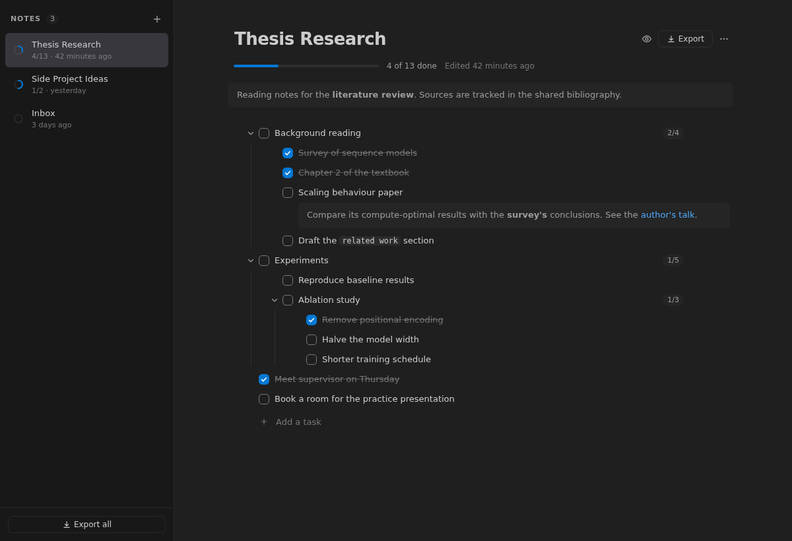
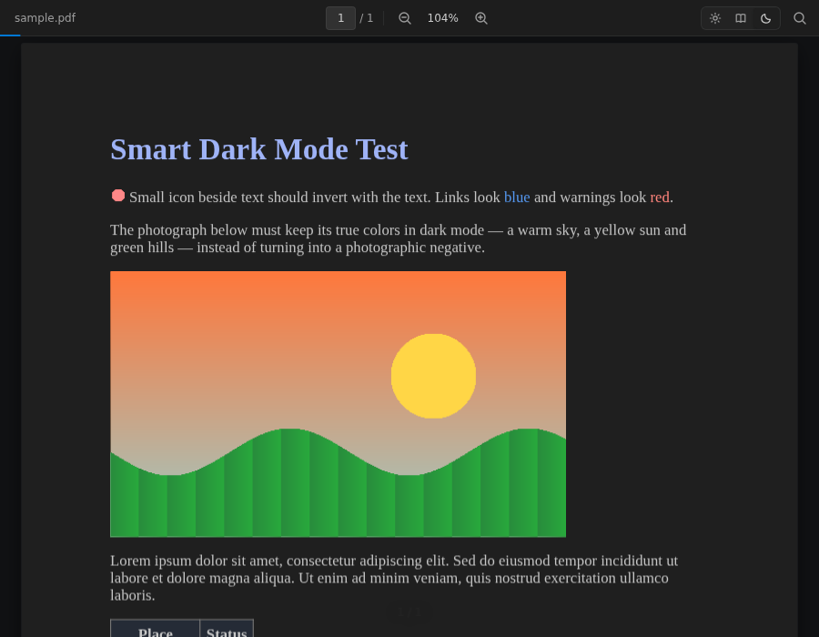
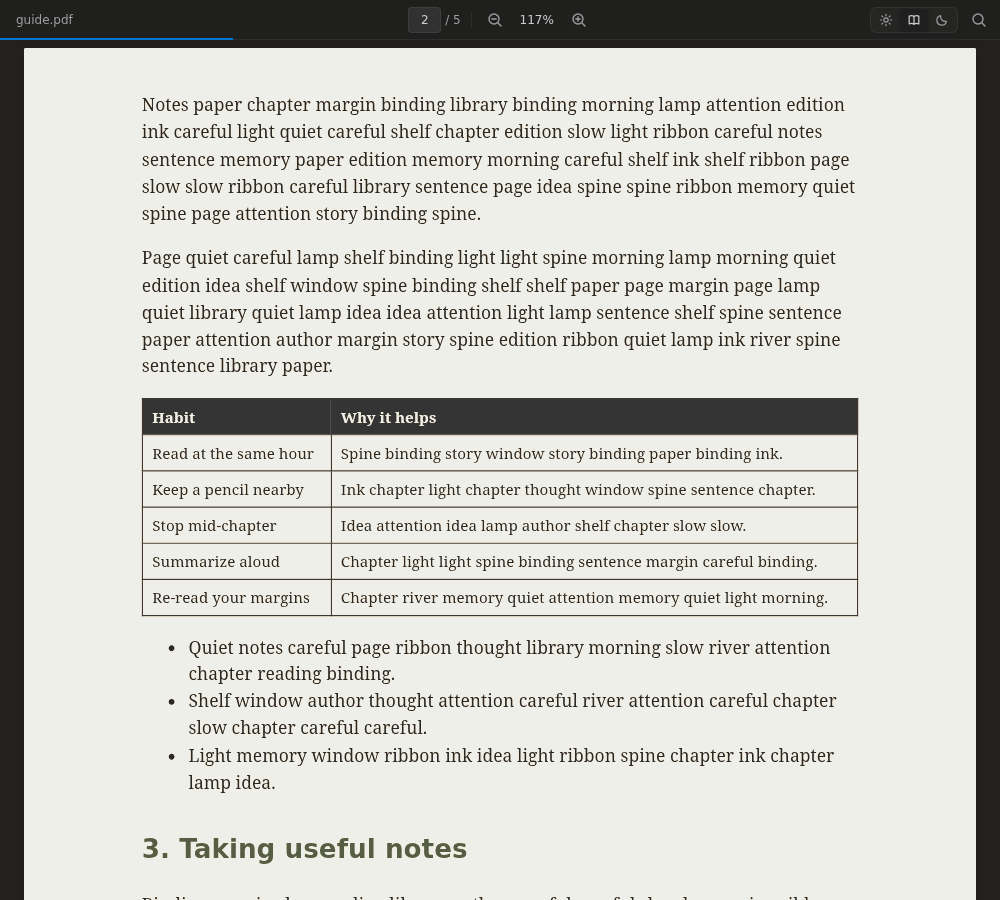
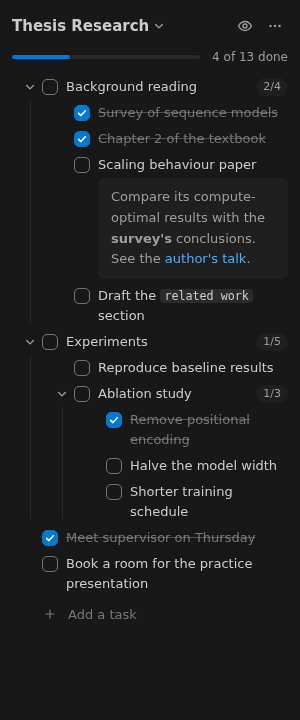
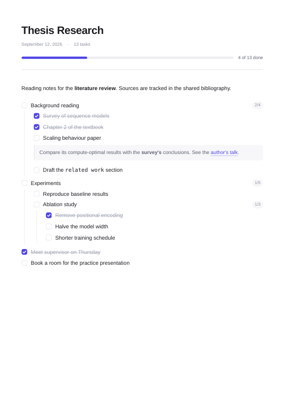

# PaperDesk

A PDF reader and a ClickUp-style notes & task outliner, living side by side in VS Code.

- **Read** PDFs in light, sepia or a _smart_ dark mode that keeps photos and figures in true color.
- **Resume** every document at the exact page you left it.
- **Capture** notes and infinitely nested tasks, each with its own rich Markdown notes.
- **Own your data** — every note is a plain `.md` file in your workspace.
- **Export** to Markdown or a beautifully typeset PDF.



---

## Reading PDFs

Open any `.pdf` file — PaperDesk becomes its default viewer.

| | |
| --- | --- |
|  |  |
| **Smart dark mode.** Text turns light on a soft charcoal page, colors keep their meaning, and photos stay true to life instead of becoming negatives. | **Sepia** for long reading sessions. |

**How smart dark mode works.** The page is rendered normally, then a partial invert
(`invert(0.88) hue-rotate(180deg)`) is applied as a CSS filter — white becomes charcoal, black becomes soft
white, and hue rotation puts reds back on red and blues back on blue. PaperDesk then walks the page's drawing
instructions to find exactly where each raster image was painted, and lays an unfiltered copy of those pixels
back on top. Tiny images (icons) invert with the text; page-sized images (scans) are left inverted so scanned
documents still read in dark mode. Every number involved is a setting.

**Resume where you left off.** Your page, position within it, zoom and theme are remembered per document,
across windows and restarts. The document opens straight at that spot — no flash of page 1.

**Everything else a reader needs:** selectable, copyable text · find in document with every hit highlighted ·
table of contents from the PDF's bookmarks · fit width / fit page / preset zoom · pages rendered on demand, so
long documents stay fast.

| Shortcut | Action |
| --- | --- |
| <kbd>Ctrl</kbd>+<kbd>F</kbd> | Find in document (<kbd>Enter</kbd> next, <kbd>Shift</kbd>+<kbd>Enter</kbd> previous) |
| <kbd>Ctrl</kbd>+<kbd>+</kbd> / <kbd>Ctrl</kbd>+<kbd>−</kbd> | Zoom in / out (also <kbd>Ctrl</kbd>+scroll) |
| <kbd>Ctrl</kbd>+<kbd>0</kbd> | Fit width |

---

## Notes & tasks

Click the **PaperDesk** icon in the activity bar for the compact sidebar, or run **PaperDesk: Open Notes**
(<kbd>Ctrl</kbd>+<kbd>Alt</kbd>+<kbd>N</kbd>) for the full workspace.



Everything is edited in place:

- **Click a checkbox** to complete a task. Checking a parent completes its subtasks; unchecking a subtask
  reopens its parents. Progress rolls up everywhere.
- **Click a title** to edit it. Titles support inline Markdown — `**bold**`, `` `code` ``, links.
- **Add notes** to any task with <kbd>Shift</kbd>+<kbd>Enter</kbd> or the pencil button. Notes are full
  Markdown: paragraphs, lists, code blocks, tables.
- **Drag** the handle to reorder, or drop onto a task to nest inside it.
- **Focus** on one task from its <kbd>⋯</kbd> menu to work on just that branch.
- **Quick capture** from anywhere with **PaperDesk: Quick Add Task** (<kbd>Ctrl</kbd>+<kbd>Alt</kbd>+<kbd>T</kbd>).

<br clear="right">

| While editing a task | |
| --- | --- |
| <kbd>Enter</kbd> | New task below |
| <kbd>Tab</kbd> / <kbd>Shift</kbd>+<kbd>Tab</kbd> | Nest / un-nest |
| <kbd>Ctrl</kbd>+<kbd>Enter</kbd> | Complete |
| <kbd>Shift</kbd>+<kbd>Enter</kbd> | Add notes |
| <kbd>↑</kbd> / <kbd>↓</kbd> | Previous / next task |
| <kbd>Alt</kbd>+<kbd>↑</kbd> / <kbd>Alt</kbd>+<kbd>↓</kbd> | Move task up / down |
| <kbd>Backspace</kbd> on an empty task | Delete it |

### Your notes are just Markdown

Notes live in a `.notes/` folder in your workspace, one file per note. The format is ordinary GitHub-flavored
Markdown — readable on GitHub, diffable in git, editable in any editor. Edit a file by hand and the UI updates;
edit in the UI and your hand formatting is preserved.

```md
---
title: Thesis Research
created: 2026-09-10T09:00:00.000Z
updated: 2026-09-12T16:40:00.000Z
---

Reading notes for the **literature review**.

- [ ] Background reading
  - [x] Survey of sequence models
  - [ ] Scaling behaviour paper

    Compare its compute-optimal results with the **survey's** conclusions.

  - [ ] Draft the `related work` section
```

A task's notes are simply the indented paragraphs beneath it — exactly how Markdown already nests content in a
list item.

---

## Exporting



Export a single note or all of them from the **Export** menu, a note's <kbd>⋯</kbd> menu, or the command palette:

- **Preview** — see the styled document beside your editor.
- **Markdown** — clean `.md`, with or without frontmatter and completed tasks.
- **PDF** — typeset and paginated, with drawn checkboxes, progress bars and nested guide lines.

The preview, the exported HTML and the PDF all come from one stylesheet, so what you preview is what you get.
PDFs are printed by the Chrome, Chromium, Edge or Brave already on your machine — nothing extra is downloaded.
If none is found, PaperDesk opens the styled document in your browser so you can print it to PDF from there.

<br clear="right">

---

## Settings

Everything tunable is a setting — search **PaperDesk** in the Settings editor.

| Setting | Default | |
| --- | --- | --- |
| `paperdesk.notes.folderName` | `.notes` | Where notes are stored in the workspace |
| `paperdesk.notes.cascadeCompletion` | `always` | Completing a parent completes subtasks: `always`, `ask`, `never` |
| `paperdesk.pdf.defaultTheme` | `auto` | First-open theme; `auto` follows your VS Code theme |
| `paperdesk.pdf.restoreLastPage` | `true` | Reopen documents where you left off |
| `paperdesk.pdf.dark.filter` | `invert(0.88) hue-rotate(180deg)` | The dark mode look |
| `paperdesk.pdf.dark.protectImages` | `true` | Keep photos and figures in true color |
| `paperdesk.export.pageFormat` | `A4` | Paper size for PDF export |
| `paperdesk.export.accentColor` | `#4f46e5` | Accent for headings, checkboxes and progress |
| `paperdesk.export.browserPath` | _auto-detect_ | Browser used to print PDFs |

…plus zoom limits, render window, image-protection thresholds, sepia filter, margins and more.

---

## Development

Requires Node.js 20+.

```sh
npm install
```

Then press <kbd>F5</kbd> and pick **Run Extension (hot reload)**. This starts the Vite dev server and the
extension host build in watch mode, and opens an Extension Development Host window.

- Editing anything under `src/webview/` updates the open view instantly — no reload.
- Editing extension host code rebuilds automatically; run **Developer: Reload Window** in the host window.

**Run Extension (production build)** runs the bundled webviews instead, exactly as they ship.

| Script | |
| --- | --- |
| `npm run dev` | Vite dev server + host build in watch mode |
| `npm run build` | Production build of webviews and host into `dist/` |
| `npm run typecheck` | TypeScript, strict |
| `npm run lint` | ESLint |
| `npm run vsix` | Package an installable `.vsix` |

Install a packaged build with `code --install-extension paperdesk-0.1.0.vsix`.

### Architecture

```
src/
├── extension.ts        Activation: wires providers and commands, nothing else
├── config.ts           Typed access to every setting — the only reader of configuration
├── core/               Pure logic, no VS Code imports
│   ├── model.ts          NoteDoc and TaskNode
│   ├── markdown/         Markdown ⇄ NoteDoc, lossless round trip
│   └── tree.ts           Immutable task-tree operations
├── store/              NotesStore (files, watcher, debounced saves) · ReadingState
├── pdf/                Custom editor provider for *.pdf
├── notes/              Sidebar view, full-tab panel, and the controller they share
├── export/             One stylesheet → preview, HTML, PDF
└── webview/            React apps (Vite)
    ├── protocol.ts       Message types shared by host and webviews
    ├── ui/               Design tokens and shared components
    ├── notes/            Outliner
    └── pdf/              Viewer, smart dark mode, search, outline
```

The host and webviews talk only through the typed messages in `protocol.ts`, so changing a message shape is a
compile error on whichever side hasn't caught up. The UI inherits colors from your VS Code theme through
`--vscode-*` variables, so it looks native in any theme.

## License

MIT
